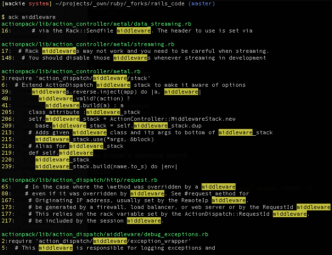
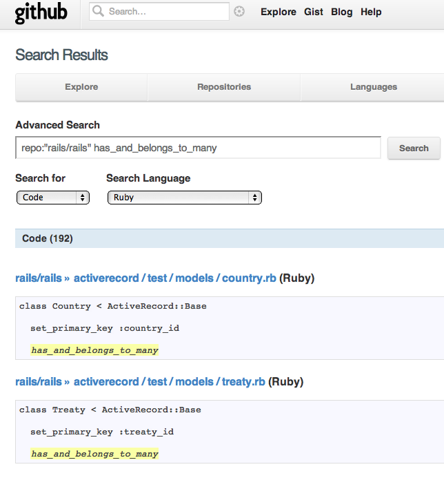
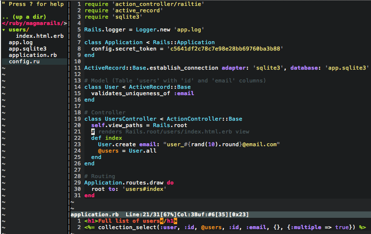
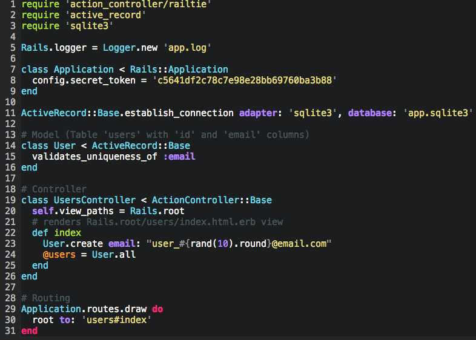
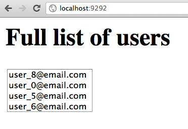
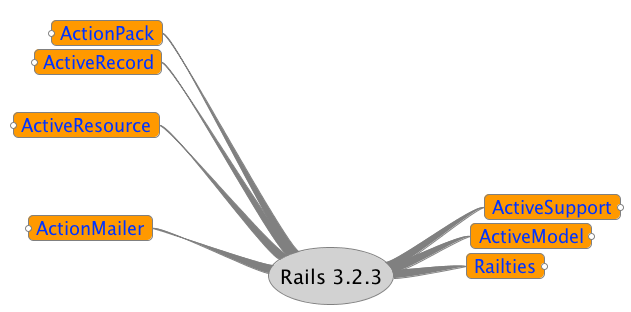
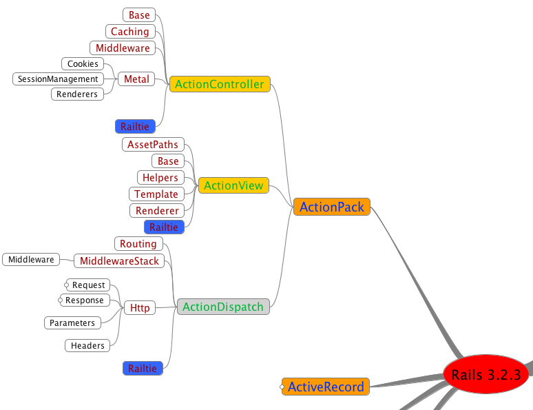
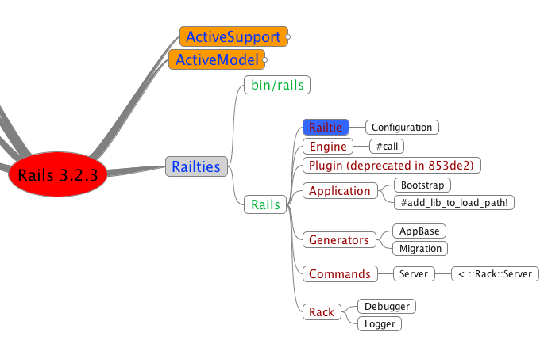
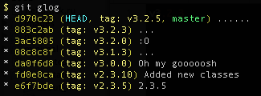
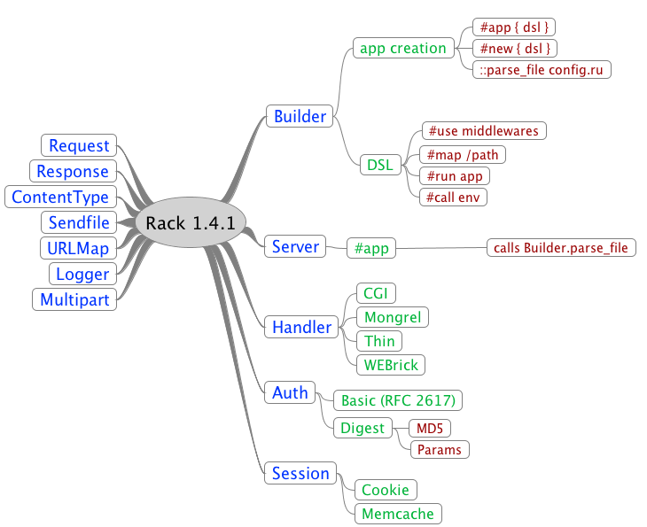

!SLIDE section

Tools

!SLIDE big reason

Use a debugger

!SLIDE big reason

Use a logger

!SLIDE big reason

Use *find*, *grep* or *ack*

!SLIDE 

!SLIDE big reason

Use Github's  
advanced search

!SLIDE

!SLIDE big reason

Write minimal applications

!SLIDE

!SLIDE

!SLIDE

!SLIDE big reason

IRC freenode

!SLIDE big reason

email and twitter

!SLIDE big reason

Don't use an IDE

!SLIDE big reason

Take notes

!SLIDE big reason

Use a whiteboard

!SLIDE

!SLIDE big reason

Build a mental map  
*http://freemind.sourceforge.net*

!SLIDE

!SLIDE

!SLIDE

!SLIDE

!SLIDE

	@@@bash
	git checkout v2.3.5

!SLIDE

	@@@bash
	git checkout v3.0.0

!SLIDE

	@@@bash
	git checkout v3.2.3
	
!SLIDE

!SLIDE big reason

Think!